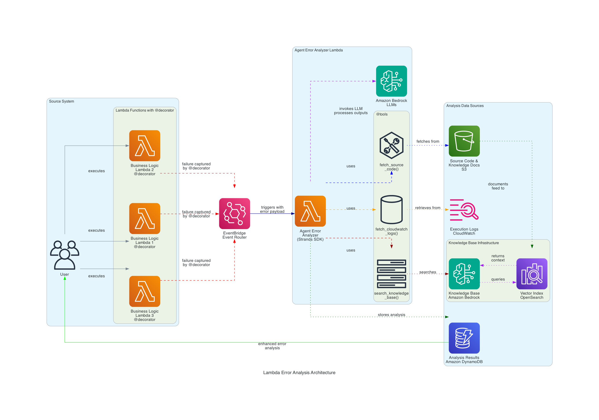

# Lambda Error Analysis Agent

AI-powered Lambda error diagnostics that transforms generic error messages into intelligent root cause analysis with actionable fix recommendations and confidence scoring.

## Overview

### Sample Details

| Information            | Details                                                         |
| ---------------------- | --------------------------------------------------------------- |
| **Agent Architecture** | Single-agent with multi-tool orchestration                      |
| **Native Tools**       | None                                                            |
| **Custom Tools**       | fetch_source_code, fetch_cloudwatch_logs, search_knowledge_base |
| **MCP Servers**        | None                                                            |
| **Use Case Vertical**  | DevOps / Software Development                                   |
| **Complexity**         | Advanced                                                        |
| **Model Provider**     | Amazon Bedrock (Claude Sonnet 3.7, Claude Sonnet 4)             |
| **SDK Used**           | Strands Agents SDK, AWS CDK, boto3                              |

### Architecture



**Event-driven error analysis system** that automatically investigates Lambda failures using AI:

1. Lambda function fails → `@error_capture` decorator publishes event to EventBridge
2. EventBridge triggers Error Analyzer Agent
3. Agent uses 3 tools to gather context:
   - `fetch_source_code` - Retrieves Lambda source from S3/deployment package
   - `fetch_cloudwatch_logs` - Gets execution logs filtered by request ID
   - `search_knowledge_base` - Queries Bedrock Knowledge Base for error patterns
4. Claude Sonnet 4 analyzes with interleaved thinking and generates:
   - Root cause identification
   - Specific fix recommendations
   - Confidence score (0.0-1.0) based on evidence quality
5. Results stored in DynamoDB for historical analysis

### Key Features

- **Automated Error Investigation** - No manual log diving, agent gathers all context automatically
- **Multi-Source Analysis** - Combines source code, execution logs, and documentation for comprehensive insights
- **Interleaved Thinking** - Claude Sonnet 4 reasons between tool calls for smarter investigation
- **Confidence Scoring** - Evidence-based scoring (0.0-1.0) indicates analysis reliability
- **Historical Tracking** - All analyses stored in DynamoDB for pattern recognition
- **Reusable Decorator** - Simple `@error_capture` wrapper for any Lambda function
- **9 Test Scenarios** - Comprehensive test cases covering common validation errors

## Prerequisites

- **AWS Account** with appropriate permissions
- **AWS CLI** configured with credentials (`aws configure`)
- **Node.js** 18+ and npm
- **Python** 3.12+
- **Docker** installed and running (for building Lambda layers)
- **Amazon Bedrock** [model access](https://docs.aws.amazon.com/bedrock/latest/userguide/model-access-modify.html) enabled for:
  - Claude Sonnet 3.7 (`us.anthropic.claude-3-7-sonnet-20250219-v1:0`)
  - Claude Sonnet 4 (`us.anthropic.claude-sonnet-4-20250514-v1:0`)

## Setup

1. **Install dependencies:**

   ```bash
   npm install
   ```

2. **Bootstrap CDK** (if not done already):

   ```bash
   npx cdk bootstrap
   ```

3. **Build and deploy infrastructure:**

   ```bash
   npm run deploy
   ```

   This will:

   - Build TypeScript CDK code
   - Build Strands Lambda layer using Docker
   - Deploy all AWS resources (Lambda, EventBridge, DynamoDB, S3, Bedrock Knowledge Base)

4. **Sync Knowledge Base** (after deployment):

   Open the Jupyter notebook to sync the Knowledge Base with documentation:

   ```bash
   jupyter notebook deploy-agent.ipynb
   ```

   Run the "Sync Knowledge Base" section to ingest error patterns and best practices.

## Usage

**Interactive deployment and testing** (recommended):

```bash
jupyter notebook deploy-agent.ipynb
```

The notebook provides:

- Step-by-step deployment walkthrough
- 3 pre-configured test scenarios
- Real-time log monitoring
- Analysis results visualization
- DynamoDB query examples

**Test scenarios included:**

1. Missing email field (KeyError)
2. Null email value (AttributeError)
3. Zero age division (ZeroDivisionError)

**Direct CDK deployment:**

```bash
# Deploy
npm run cdk deploy

# View stack outputs
aws cloudformation describe-stacks --stack-name LambdaErrorAnalysisStack

# Invoke business function with test payload
aws lambda invoke \
  --function-name <business-function-name> \
  --payload '{"user_data":{"profile":{"name":"Test"},"age":25}}' \
  response.json
```

## Cleanup

When you're done testing, destroy all AWS resources:

```bash
npx cdk destroy --force
```

Or use the cleanup section in the Jupyter notebook.

## Project Structure

| Component               | File(s)                                           | Description                                                    |
| ----------------------- | ------------------------------------------------- | -------------------------------------------------------------- |
| **CDK Infrastructure**  | `cdk-app.ts`, `cdk.json`, `package.json`          | CDK application entry point and configuration                  |
| **CDK Stack**           | `cdk/stacks/lambda-error-analysis-agent-stack.ts` | Main infrastructure stack definition                           |
| **Business Function**   | `cdk/lambda/sample-business-function/`            | Demo Lambda with intentional bugs and @error_capture decorator |
| **Error Analyzer**      | `cdk/lambda/error-analyzer-agent/`                | AI agent with 3 custom tools for error analysis                |
| **Lambda Layer**        | `cdk/layers/strands-layer/`                       | Strands SDK dependencies layer with build script               |
| **Knowledge Base**      | `knowledge_base/*.md`                             | Error patterns, best practices, troubleshooting guides         |
| **Diagrams**            | `images/`                                         | Architecture diagrams with generation script                   |
| **Deployment Notebook** | `deploy-agent.ipynb`                              | Interactive deployment and testing walkthrough                 |

## How It Works

### Sample Business Function

Simulates a digital banking user registration service with 8 intentional bugs:

- Missing required fields (email, profile)
- Null value handling
- Type conversion errors
- Division by zero edge cases
- Nested data access failures

### Error Analyzer Agent

Strands Agent with Claude Sonnet 4 featuring **interleaved thinking**:

- Reasons between tool calls for smarter investigation
- Uses 3 custom tools: `fetch_source_code`, `fetch_cloudwatch_logs`, `search_knowledge_base`
- Calculates confidence score (0.0-1.0) based on evidence quality
- Stores results in DynamoDB for historical tracking

### Confidence Scoring

```
Score = Knowledge Base (0.0-0.4) + Source Code (0.0-0.3) + Logs (0.0-0.3)

0.8+   : Very High confidence
0.6-0.8: High confidence
0.4-0.6: Medium confidence
0.2-0.4: Low confidence
<0.2   : Very Low confidence
```

## Example Analysis

**Input Error:**

```
KeyError: 'email'
Payload: {"profile": {"name": "Jane"}, "age": 25}
```

**AI Analysis (8 seconds):**

```
🤖 Root Cause: Missing 'email' field in user_data dictionary

💡 Fix: Add input validation before processing:
   required_fields = ['email', 'profile', 'age']
   missing = [f for f in required_fields if f not in user_data]
   if missing:
       raise ValueError(f"Missing: {missing}")

📊 Confidence: 0.85 (High)
📈 Evidence: Source code + logs + 3 KB docs
```

## Troubleshooting

| Symptom                   | Likely Cause               | Fix                                                                                                 |
| ------------------------- | -------------------------- | --------------------------------------------------------------------------------------------------- |
| Docker build fails        | Docker not running         | Start Docker Desktop and retry                                                                      |
| CDK bootstrap error       | Not bootstrapped in region | Run `npx cdk bootstrap`                                                                             |
| Bedrock access denied     | Models not enabled         | Enable Claude models in [Bedrock console](https://console.aws.amazon.com/bedrock/home#/modelaccess) |
| Knowledge Base sync fails | Ingestion job timeout      | Check S3 bucket permissions and retry                                                               |
| Agent not analyzing       | EventBridge rule disabled  | Check rule status: `aws events list-rules --name-prefix LambdaErrorAnalysis`                        |
| Low confidence scores     | Missing evidence           | Ensure source code uploaded to S3 and Knowledge Base synced                                         |

## Additional Resources

- [Strands Agents SDK Documentation](https://strandsagents.com/latest/documentation/docs/)
- [AWS CDK Developer Guide](https://docs.aws.amazon.com/cdk/v2/guide/home.html)
- [Amazon Bedrock User Guide](https://docs.aws.amazon.com/bedrock/)
- [Claude Sonnet 4 with Interleaved Thinking](https://www.anthropic.com/claude)
- [AWS Lambda Best Practices](https://docs.aws.amazon.com/lambda/latest/dg/best-practices.html)

---

## Disclaimer

This sample is provided for educational and demonstration purposes only. It is not intended for production use without further development, testing, and hardening.

For production deployments, consider:

- Implementing appropriate content filtering and safety measures
- Following security best practices for your deployment environment
- Conducting thorough testing and validation
- Reviewing and adjusting configurations for your specific requirements
- Setting up proper monitoring and alerting
- Implementing cost controls and budgets
- Reviewing and securing IAM permissions
- Encrypting sensitive data at rest and in transit
