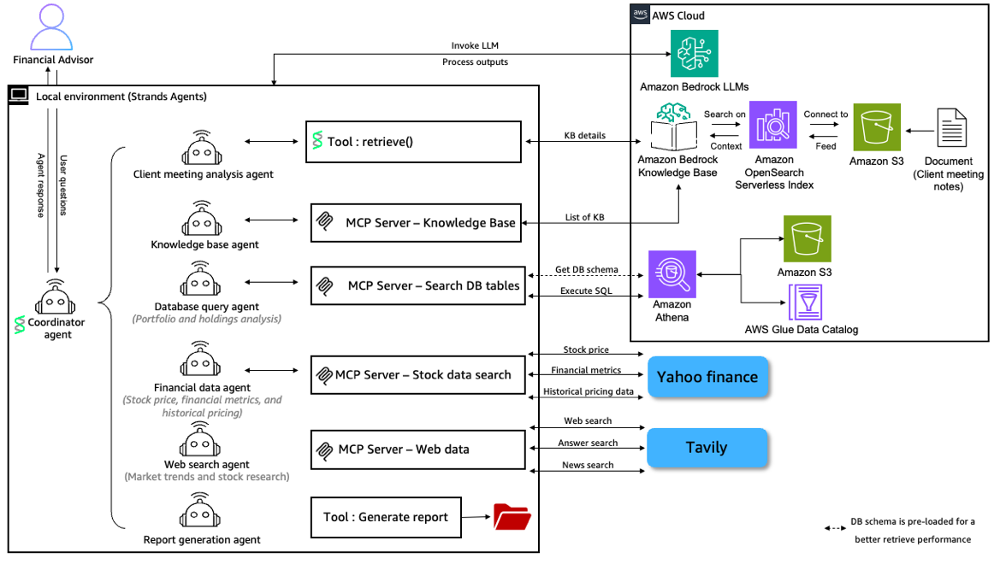
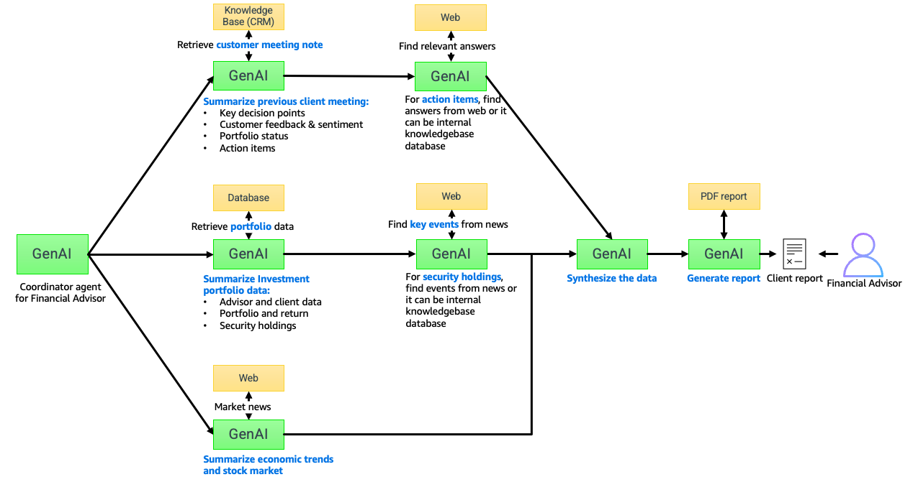

# GenAI-Powered Financial Advisor

A comprehensive GenAI-powered wealth and financial advisory tools built with **Strands Agents**, **Amazon Bedrock**, and **MCP** designed to automate client meeting analysis, advisor follow-up item analysis, client portfolio analysis, market research, and report generation for financial advisors.

## ✨ Key Features

### 📊 Financial Analysis Capabilities
- **Portfolio Analysis**: Comprehensive portfolio performance tracking and analysis
- **Stock Market Data**: Real-time stock pricing, historical data, and market trends
- **Market Research**: Web-based research using Tavily integration
- **Performance Metrics**: Detailed financial metrics and comparative analysis

### 📝 Client Meeting Management
- **Meeting Analysis**: AI-powered analysis of client meeting notes and transcripts
- **Sentiment Analysis**: Customer sentiment assessment with supporting evidence
- **Action Item Extraction**: Automated identification of follow-up tasks , decisions and find necessary answers

### 📈 Reporting & Documentation
- **PDF Report Generation**: Professional client reports with charts and analysis

### 🤖 AI-Powered Chat Interface
- **Interactive UI**: Streamlit-based interface with example queries and configuration options

## 🏗️ Architecture
Overall architecture in multi-agent collaboration with MCP and tools.


Autonomous agents are a current market trend. Complex inquiries will take time to complete. Here is the process flow for financial advisors to complete complex tasks using **Strands Agents Graph pattern**



### Core Components

```
17-genai-powered-financial-advisor-tools/
├── application/           # Main application code
│   ├── app.py            # Streamlit web interface
│   ├── chat.py           # Core chat logic and agent 
│   ├── info.py           # Model configuration
│   ├── prompt.py         # System prompts for GenAI
│   ├── retrieve_schema.py # pre-load database schema
│   ├── mcp_server_*.py   # MCP server implementations
│   └── prerequisites/    # Setup and configuration
│       ├── athena_database_setup.py
│       ├── bedrock_knowledge_base_setup.py
│       ├── prereqs_config.yaml
│       └── client_meeting_note.txt
├── assets/              # Application assets (fonts, images)
│   ├── AmazonEmber_Lt.ttf
│   ├── architecture_graph.png
│   └── architecture.png
├── outputs/             # Generated reports and charts
│   ├── charts/          # Stock charts and visualizations
│   └── reports/         # PDF reports and analysis documents
├── requirements.txt     # Python dependencies
├── README.md
├── .env.example
└── deploy_prereqs.sh
```
### MCP (Model Context Protocol) Servers

The application includes specialized MCP servers for different data sources:

- **Stock Data Server** (`mcp_server_stock.py`): Yahoo Finance API integration for stock data
- **Athena Server** (`mcp_server_athena.py`): AWS Athena database queries for portfolio data
- **Tavily Server** (`mcp_server_tavily.py`): Web search capabilities for market research
- **Knowledge Base List Server** (`mcp_server_kb.py`): Amazon Bedrock Knowledge Bases integration

### Specialized AI Agents

- **Client Meeting Analysis Agent**: Processes meeting notes and extracts insights
- **Web Search Agent**: Conducts comprehensive web research for financial information
- **Market Search Agent**: Specialized market research and economic analysis
- **Database Query Agent**: Retrieves portfolio and client data from databases
- **Stock Analysis Agent**: Real-time stock data analysis and reporting
- **Report Generation Agent**: Generate PDF report

## 🚀 Quick Start

### Prerequisites

- **Python 3.8+** (Python 3.9+ recommended)
- **AWS Account** with Bedrock access and appropriate permissions
- **AWS CLI** configured with credentials
- **Required AWS Services**:
  - Amazon Bedrock (Claude models v3.7 and v4.0, follow instructions [here](https://docs.aws.amazon.com/bedrock/latest/userguide/model-access-modify.html))
  - Amazon Bedrock Knowledge Bases (for doucment queries)
  - AWS Athena (for database queries)
  - Amazon S3 (for data storage)

### Installation

1. **Clone and navigate to the GenAI_powered_financial_advisor_tools directory**:
   ```bash
   git clone https://github.com/strands-agents/samples.git
   cd 17-genai-powered-financial-advisor-tools
   ```

2. **Set up Python virtual environment**:
   ```bash
   python -m venv .venv
   source .venv/bin/activate  # On Windows: .venv\Scripts\activate
   ```

3. **Install dependencies**:
   ```bash
   pip install -r requirements.txt
   ```

3. **Configure AWS credentials**:
   ```bash
   aws configure
   
   # Or set environment variables:
   
   export AWS_ACCESS_KEY_ID=your_access_key
   export AWS_SECRET_ACCESS_KEY=your_secret_key
   export AWS_DEFAULT_REGION=us-west-2

   ```

4. **Set up prerequisites**:
   
   This script will create Amazon Bedrock Knowledge Bases. Also, it will create database, tables, and insert sample data using Amazon Athena. 
   ```bash
   bash deploy_prereqs.sh 
     ```

6. **Create Tavily API key and add in the .env file**:
   
   Visit [Travily](https://www.tavily.com/) and create API key post sign-up. Update your tavily api key in .env file. This is mandatory required to run the GenAI tools :
   ```bash
   TAVILY_API_KEY="" 
   ```

6. **Start the application**:
   
   Execute the following commands in the "17-genai-powered-financial-advisor-tools" directory
   ```bash
   streamlit run application/app.py
   ```

7. **Access the application**:
   - Open your browser to `http://localhost:8501` 
   - Select your preferred AI model from the sidebar
   - Start interacting with the Financial Advisor AI

## 🔧 Configuration

### Prerequisites Configuration

The null fields will be automatically updated when you run deploy_prereqs.sh file
`application/prerequisites/prereqs_config.yaml`:

```yaml
database_name: null
knowledge_base_description: financial advisor
knowledge_base_id: null
knowledge_base_name: null
project_name: financial-advisor
project_short_name: fa
region_name: us-west-2
s3_bucket_name_for_athena: null
s3_bucket_name_for_kb: null

```

## 💡 Usage Examples

### Portfolio Analysis
```
"Michael Chen's Portfolio Summary"
```
Retrieves comprehensive portfolio information including holdings, performance metrics, and analysis.

### Stock Market Research
```
"Amazon stock pricing today"
"Compare Amazon and Microsoft stock performance over the last year"
"The prospects for the US stock market for remaining 2025"
```

### Client Meeting Analysis
```
"client meeting summary of knowledge base ID kb-12345" (your knowledge base id)
"using knowledge base Financial advisor Sarah Johnson, Provide a complete customer report"
```

### Market Research
```
"Latest trends in renewable energy investments"
"Federal Reserve interest rate impact on tech stocks"
```

## 📚 Dependencies

### Core Dependencies
- **strands-agents**: AI agent framework
- **streamlit**: Web interface framework
- **boto3**: AWS SDK for Python
- **pandas**: Data manipulation and analysis
- **matplotlib**: Plotting and visualization
- **reportlab**: PDF generation
- **yfinance**: Stock market data
- **tavily-python**: Web search capabilities
- **mcp**: Model Context Protocol implementation


7. **Access the application**:
   - Open your browser to `http://localhost:8501` (Check "7. Start the application" in the above instruction)
   - Select your preferred AI model from the sidebar
   - Start interacting with the Financial Advisor AI

## 🔧 Cleanup

Clean up created resources by executing the scripts in the application/prerequisites/ directory:

```yaml
#Delete knowledge base relavent resources
python bedrock_knowledge_base_setup.py --mode delete

#Delete database relavent resources
python athena_database_setup.py --mode delete
```

## 📄 License

This project is licensed under the MIT No Attribution License - see the [LICENSE](LICENSE) file for details.

## 🤝 Contributing

Contributions are welcome! Please:

1. Fork the repository
2. Create a feature branch
3. Add comprehensive tests
4. Update documentation
5. Submit a pull request

## 📞 Support

For support and questions:

1. **Review your permission** on AWS 
2. **Tavily API KEY** is added on .env file
3. **Verify model access** in Bedrock console
4. **Test basic functionality** with simple queries
5. **Check application logs** for detailed error information

## 🔗 Related Resources

- [Strands Agents Documentation](https://strandsagents.com/)
- [AWS Bedrock Documentation](https://docs.aws.amazon.com/bedrock/)
- [Amazon Bedrock Knowledge Bases](https://docs.aws.amazon.com/bedrock/latest/userguide/knowledge-base.html)
- [Streamlit Documentation](https://docs.streamlit.io/)

---

**Transform your financial advisory practice with AI-powered insights and automation! 🚀**