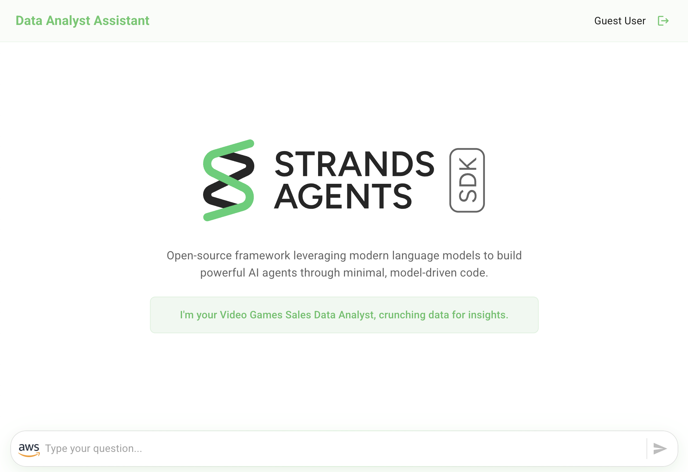
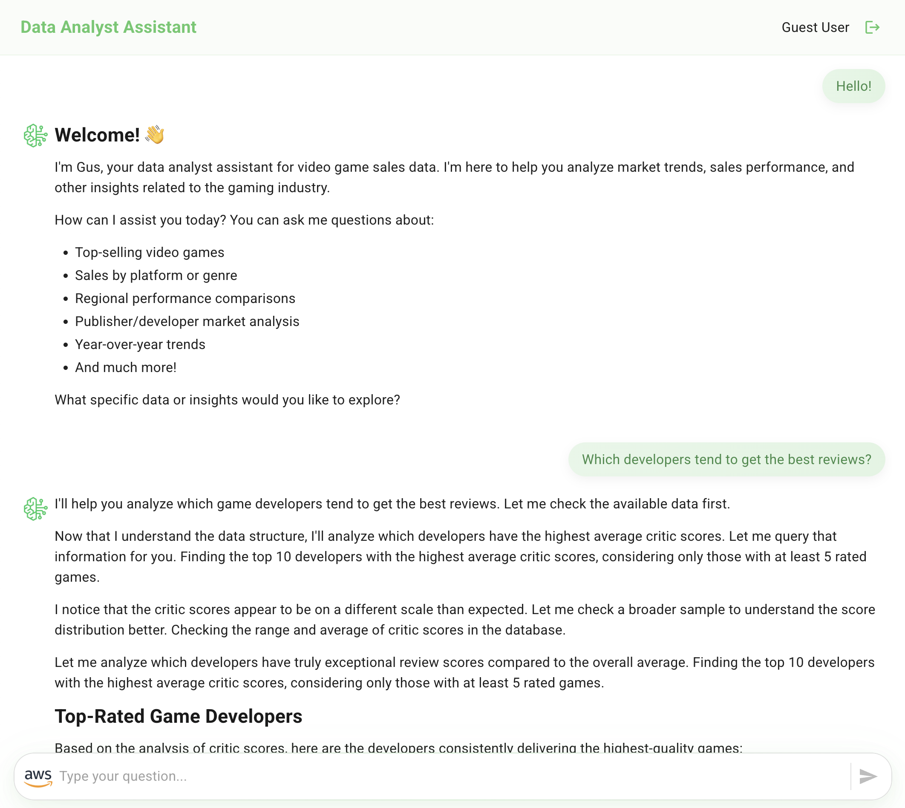
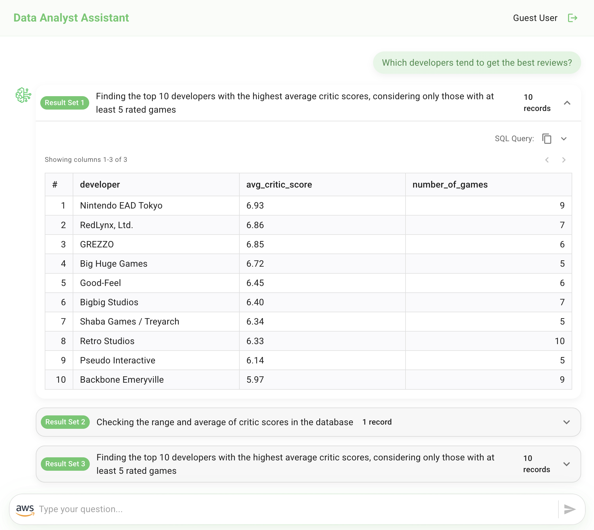
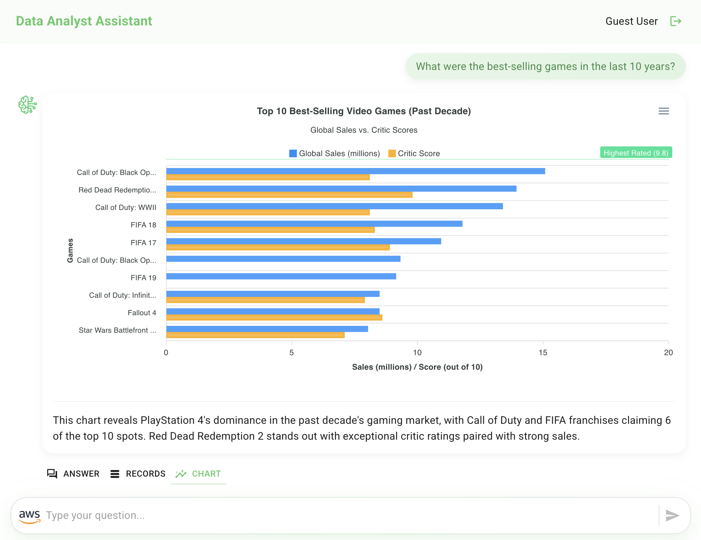
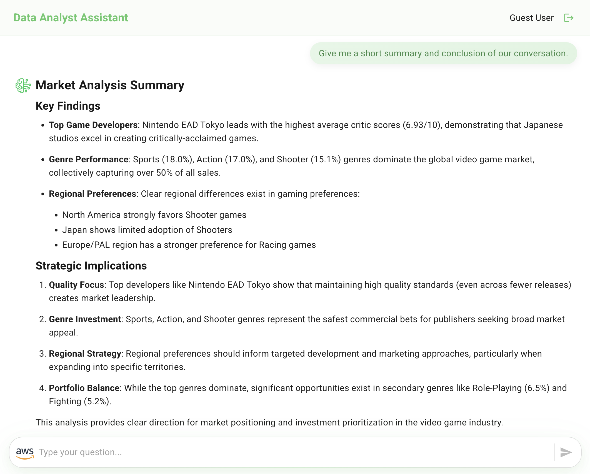

# Front-End Implementation - Integrating Strands Agent with a Ready-to-Use Data Analyst Assistant Application

This tutorial guides you through setting up a React Web application that integrates with your [Strands Agent](https://strandsagents.com), creating a Data Analyst Assistant for Video Game Sales.

## Overview

By the end of this tutorial, you'll have a fully functional Generative AI web application that allows users to interact with a Data Analyst Assistant interface.

The application consists of two main components:

- **React Web Application**: Provides the user interface and handles user interactions
- **Strands Agent Integration**: 
    - Uses your Strands Agent for data analysis and natural language processing
    - The application invokes the Strands Agent by calling the Application Load Balancer (ALB) endpoint
    - Communicates with the agent through HTTP requests to the ALB for interactive assistant functionality
    - Directly invokes Claude 3.7 Sonnet model for chart generation and visualization

> [!IMPORTANT]
> This sample application is for demonstration purposes only and is not production-ready. Please validate the code against your organization's security best practices.

## Prerequisites

Before you begin, ensure you have:

- [Node.js version 18+](https://nodejs.org/en/download/package-manager)
- React Scripts installed:
``` bash
npm install react-scripts
```

## Set Up the Front-End Application

### Install Dependencies

Navigate to the React application folder (amplify-video-games-sales-assistant-strands/) and install the dependencies:

``` bash
npm install
```

### Install Amplify CLI

Install the Amplify CLI globally:

``` bash
npm install -g @aws-amplify/cli
```

### Initialize Amplify Project

Initialize the Amplify project:

``` bash
amplify init
```

- Do you want to continue with Amplify Gen 1? **`Yes`**
- Why would you like to use Amplify Gen 1? **`Prefer not to answer`**

Use the following configuration:
- ? Enter a name for the project: **`daastrandsagent`**

Use the following default configuration:
- Name: **daastrandsagent**
- Environment: dev
- Default editor: Visual Studio Code
- App type: javascript
- Javascript framework: react
- Source Directory Path: src
- Distribution Directory Path: build
- Build Command: npm run-script build
- Start Command: npm run-script start

- ? Initialize the project with the above configuration? **`Yes`**
- ? Select the authentication method you want to use: **`AWS profile`**

### Add Authentication

Add Amazon Cognito authentication to enable user sign-in and secure access to your Data Analyst Assistant:

``` bash
amplify add auth
```

Use the following configuration:

- Do you want to use the default authentication and security configuration?: **`Default configuration`**
- How do you want users to be able to sign in?: **`Email`**
- Do you want to configure advanced settings?: **`No, I am done`**

> [!INFO]
> **Authentication Overview**: This creates a Cognito User Pool for user management (sign-up, sign-in, password reset) and an Identity Pool for AWS service access. Users will authenticate through the React app, receive JWT tokens, and these tokens will be validated by your backend agent.

### Deploy Backend Resources

Deploy the authentication resources to AWS:

``` bash
amplify push
```

- ? Are you sure you want to continue? **`Yes`**

> [!NOTE]
> This creates a Cognito User Pool and Identity Pool in your AWS account for user authentication. AWS credentials for the Front-End Application are automatically managed through Cognito.

## Configure AuthRole Permissions

After authentication deployment, you need to grant your authenticated users permission to access AWS services.

1. **Find your AuthRole**: Go to AWS Console → IAM → Roles → Search for amplify-daastrandsagent-dev-*-authRole
2. **Get the DynamoDB Table ARN**: From your CDK project outputs, get the `QuestionAnswersTableName` value:

``` bash
# Set the stack name environment variable
export STACK_NAME=CdkStrandsDataAnalystAssistantStack

# Get the DynamoDB table name and construct the ARN
export QUESTION_ANSWERS_TABLE_NAME=$(aws cloudformation describe-stacks --stack-name "$STACK_NAME" --query "Stacks[0].Outputs[?OutputKey=='QuestionAnswersTableName'].OutputValue" --output text)
export QUESTION_ANSWERS_TABLE_ARN="arn:aws:dynamodb:$(aws configure get region):$(aws sts get-caller-identity --query Account --output text):table/$QUESTION_ANSWERS_TABLE_NAME"
echo "Table ARN: $QUESTION_ANSWERS_TABLE_ARN"
```

3. **Add this policy** (replace `<account_id>` with your AWS account ID and `<question_answers_table_arn>` with the ARN from step 2):

``` json
{
    "Version": "2012-10-17",
    "Statement": [
        {
            "Sid": "InvokeBedrockModel",
            "Effect": "Allow",
            "Action": [
                "bedrock:InvokeModel"
            ],
            "Resource": [
                "arn:aws:bedrock:*:<account_id>:inference-profile/us.anthropic.claude-3-7-sonnet-20250219-v1:0",
                "arn:aws:bedrock:us-east-2::foundation-model/anthropic.claude-3-7-sonnet-20250219-v1:0",
                "arn:aws:bedrock:us-east-1::foundation-model/anthropic.claude-3-7-sonnet-20250219-v1:0",
                "arn:aws:bedrock:us-west-2::foundation-model/anthropic.claude-3-7-sonnet-20250219-v1:0"
            ]
        },
        {
            "Sid": "DynamoDB",
            "Effect": "Allow",
            "Action": [
                "dynamodb:Query"
            ],
            "Resource": "<question_answers_table_arn>"
        }
    ]
}
```

## Configure Environment Variables

Rename the file **src/sample.env.js** to **src/env.js**:

``` bash
mv src/sample.env.js src/env.js
```

### Get CDK Output Values

First, get the required values from your CDK project outputs:

``` bash
# Set the stack name environment variable
export STACK_NAME=CdkStrandsDataAnalystAssistantStack

# Get the DynamoDB table name and Agent endpoint from CDK outputs
export QUESTION_ANSWERS_TABLE_NAME=$(aws cloudformation describe-stacks --stack-name "$STACK_NAME" --query "Stacks[0].Outputs[?OutputKey=='QuestionAnswersTableName'].OutputValue" --output text)
export AGENT_ENDPOINT_URL=$(aws cloudformation describe-stacks --stack-name "$STACK_NAME" --query "Stacks[0].Outputs[?OutputKey=='AgentEndpointURL'].OutputValue" --output text)

echo "Table Name: $QUESTION_ANSWERS_TABLE_NAME"
echo "Agent Endpoint: http://$AGENT_ENDPOINT_URL/assistant-streaming"
```

### Update Environment Variables

In your **src/env.js** update the following environment variables:

 - **AWS_REGION**: Your AWS region (e.g., "us-east-1")
 - **QUESTION_ANSWERS_TABLE_NAME**: Use the value from the command above
 - **AGENT_ENDPOINT_URL**: Use the format "http://&lt;AgentEndpointURL&gt;/assistant-streaming" with the URL from the command above

## Test Your Data Analyst Assistant

Start the application locally:

``` bash
npm start
```

The application will open in your browser at http://localhost:3000.

> **Note**: At this point, your CDK backend still has `COGNITO_USER_POOL_ID` set to "N/A", so the agent will **not validate JWT tokens** from your frontend. The application will work, but authentication is bypassed on the backend. You'll update this configuration later to enable full authentication.

First-Time access:
1. **Create Account**: Click "Create Account" and use your email address
2. **Verify Email**: Check your email for a verification code
3. **Sign In**: Use your email and password to sign in

Try these sample questions to test the assistant:

```
Hello!
```

```
How can you help me?
```

```
What is the structure of the data?
```

```
Which developers tend to get the best reviews?
```

```
What were the total sales for each region between 2000 and 2010? Give me the data in percentages.
```

```
What were the best-selling games in the last 10 years?
```

```
What are the best-selling video game genres?
```

```
Give me the top 3 game publishers.
```

```
Give me the top 3 video games with the best reviews and the best sales.
```

```
Which is the year with the highest number of games released?
```

```
Which are the most popular consoles and why?
```

```
Give me a short summary and conclusion of our conversation.
```

## Enable Full Authentication (Production Configuration)

This step configures your backend to validate JWT tokens from authenticated users. This can be done **before or after** adding hosting and SSL to the agent.

> [!IMPORTANT]
> **Authentication Flow**: Currently your backend has `COGNITO_USER_POOL_ID` set to "N/A", which means JWT tokens are **not validated**. This section enables full authentication by connecting your Cognito User Pool to the backend agent.

### Get Cognito User Pool ID

Find the `aws_user_pools_id` value in your Amplify configuration file:

``` bash
cat src/amplifyconfiguration.json | grep aws_user_pools_id
```

This will show you the User Pool ID (format: `us-east-1_XXXXXXXXX`).

### Update CDK Project with Authentication

Navigate back to your CDK project directory and update the deployment with your Cognito User Pool ID:

``` bash
cd ../cdk-strands-data-analyst-assistant
cdk deploy --parameters CognitoUserPoolId=us-east-1_XXXXXXXXX
```

Replace `us-east-1_XXXXXXXXX` with the actual `aws_user_pools_id` value from your `amplifyconfiguration.json` file.

> [!NOTE]
> **What This Does**: This update configures your Strands Agent to validate JWT tokens against your Cognito User Pool. After this deployment, only authenticated users with valid tokens can access the agent endpoint.

### Test Authentication Validation

After updating the CDK project, you can test that JWT token validation is now working:

``` bash
# Test with invalid token (should return 401 error)
curl -d '{ "prompt": "Hello!" }' -X POST -H 'Content-Type: application/json' -H "Authorization: Bearer invalid-token" http://$AGENT_ENDPOINT_URL/assistant-streaming
```

Expected response: `{"detail":"Invalid or expired token"}`

``` bash
# Test with no token (should return 401 error)
curl -d '{ "prompt": "Hello!" }' -X POST -H 'Content-Type: application/json' http://$AGENT_ENDPOINT_URL/assistant-streaming
```

Expected response: `{"detail":"Authorization header missing"}`

## Deploy your Application with Amplify Hosting

To deploy your application you can use AWS Amplify Hosting. However, since the application communicates with the Strands Agent through the Application Load Balancer (ALB) endpoint, you need to configure HTTPS for secure communication.

### Prerequisites for Production Deployment

**SSL Certificate Configuration**: Amplify Hosting requires HTTPS communication with external endpoints. You need to add an SSL certificate to your Application Load Balancer before deploying to production.

#### Option 1: Add SSL Certificate to ALB (Recommended)

1. **Request or Import SSL Certificate**:
   - Go to AWS Certificate Manager (ACM)
   - Request a public certificate for your domain (e.g., `api.yourdomain.com`)
   - Or import an existing certificate

2. **Add HTTPS Listener to ALB**:
   - Go to EC2 Console → Load Balancers
   - Select your Strands Agent ALB
   - Add a new listener on port 443 (HTTPS)
   - Attach your SSL certificate
   - Forward traffic to the existing target group

3. **Update Security Group**:
   - Ensure the ALB security group allows inbound traffic on port 443

4. **Update DNS** (if using custom domain):
   - Point your domain to the ALB DNS name
   - Update your `src/env.js` to use the HTTPS endpoint

#### Option 2: Use CloudFront Distribution

Alternatively, you can create a CloudFront distribution in front of your ALB to handle SSL termination:

1. **Create CloudFront Distribution**:
   - Origin: Your ALB DNS name
   - Viewer Protocol Policy: Redirect HTTP to HTTPS
   - Attach SSL certificate for your domain

2. **Update Configuration**:
   - Use the CloudFront distribution URL in your `src/env.js`

### Deploy with Amplify Hosting

Once HTTPS is configured for your agent endpoint. Add hosting to your Amplify project:

``` bash
amplify add hosting
```

Use the following configuration:
- Select the plugin module: `Hosting with Amplify Console`
- Type: `Manual deployment`

### Publish Application

Build and deploy your application:

``` bash
amplify publish
```

This will build your React application and deploy it to AWS Amplify Hosting. You'll receive a URL where your application is accessible.

> [!IMPORTANT]
> **HTTPS Requirement**: Amplify Hosting applications served over HTTPS cannot make HTTP requests to external endpoints due to mixed content policies. Ensure your agent endpoint uses HTTPS before deploying to production.

### Update CDK Project with Amplify Domain

After publishing your application, you need to update your CDK project with the new Amplify domain URL for proper CORS configuration.

1. **Copy the Amplify App URL**: After `amplify publish` completes, copy the provided URL (format: `https://main.d1234567890.amplifyapp.com`)

2. **Update CDK Project**: Navigate back to your CDK project and update the deployment with your Amplify domain:

``` bash
cd ../cdk-strands-data-analyst-assistant
cdk deploy --parameters WebApplicationUrl=https://main.d1234567890.amplifyapp.com
```

Replace `https://main.d1234567890.amplifyapp.com` with your actual Amplify app URL.

This update configures the CORS settings in your Strands Agent to allow requests from your deployed Amplify application domain.

## Application Features

Congratulations! Your Data Analyst Assistant can provide you with the following conversational experience:



- **Conversational interface with an agent responding to user questions**



- **Detailed answers including the rationale behind SQL query generation**



- **Raw query results displayed in tabular format**



- **Chart visualization generated from the agent's answer and the data query results (created using [Apexcharts](https://apexcharts.com/))**.



- **Summary and conclusion derived from the data analysis conversation**


## Thank You

## License

This project is licensed under the Apache-2.0 License.